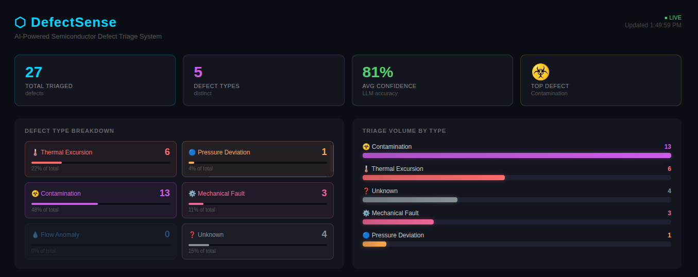
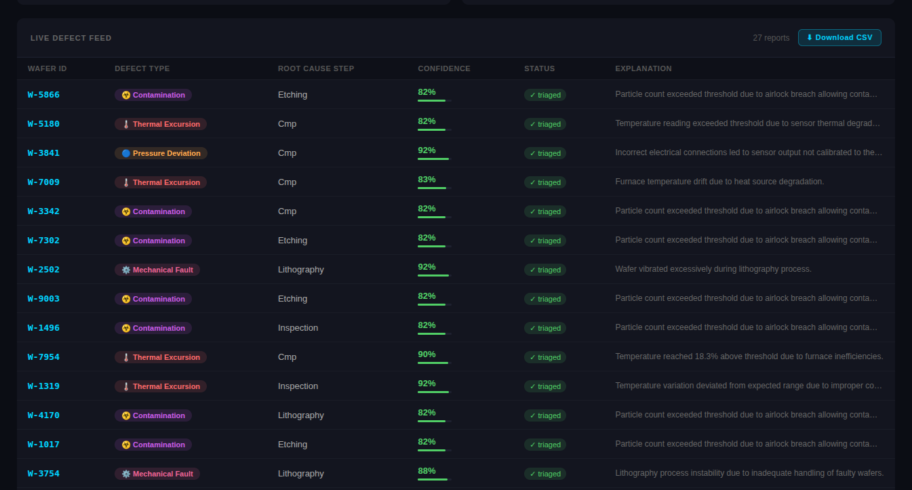

# DefectSense — AI-Powered Semiconductor Defect Triage System

An event-driven AI system that ingests real-time sensor data from semiconductor manufacturing equipment, detects anomalies, and uses a local LLM to classify defects, trace root causes across process chains, and generate triage reports — all with a live React dashboard.

---

## Dashboard





---

## Architecture

```
Sensor Events
     │
     ▼
FastAPI (POST /ingest/event)
     │  BackgroundTask
     ▼
Redis Stream (defect-events)
     │  XREAD blocking
     ▼
Prefect Worker
     ├── validate_event      → filter anomalies only
     ├── classify_defect     → RAG (ChromaDB) + Ollama LLM
     ├── trace_process_chain → NetworkX graph BFS
     └── generate_report     → save to Redis + ChromaDB history
     │
     ▼
Redis (defect-reports list)
     │
     ▼
FastAPI (GET /reports, GET /reports/stats)
     │
     ▼
React Dashboard (polls every 3s)
```

---

## Tech Stack

| Layer | Technology | Why |
|---|---|---|
| API | FastAPI + BackgroundTasks | Async ingestion, non-blocking |
| Message Queue | Redis Streams | Persistent event log, right-sized (vs Kafka) |
| AI Pipeline | Prefect | Workflow orchestration with retries + state tracking |
| LLM | Ollama llama3.2:1b | Local inference, no API cost |
| Vector DB | ChromaDB | RAG for defect knowledge + history |
| Process Graph | NetworkX DiGraph | Semiconductor process chain traversal |
| Frontend | React + Vite + nginx | Live dashboard, polled every 3s |
| Containerization | Docker Compose | One-command startup for all services |

---

## Semiconductor Process Chain

```
lithography → etching → deposition → cmp → diffusion → inspection → metrology
```

For each anomaly, the system traces:
- **Upstream steps** (BFS backwards) — likely root cause
- **Downstream impact** (BFS forward) — affected steps

---

## Defect Types Classified

| Type | Description |
|---|---|
| `thermal_excursion` | Temperature exceeded safe operating threshold |
| `pressure_deviation` | Chamber pressure outside spec |
| `contamination` | Particle count breach — airlock / clean room |
| `mechanical_fault` | Vibration or mechanical instability |
| `flow_anomaly` | Gas/fluid flow rate deviation |

---

## Project Structure

```
defectsense/
├── api/
│   ├── main.py          # FastAPI app + CORS
│   └── routes.py        # /ingest/event, /reports, /reports/stats
├── core/
│   ├── models.py        # Pydantic models (SensorEvent, DefectReport)
│   ├── redis_client.py  # Redis Stream push/read
│   ├── vectorstore.py   # ChromaDB upsert/search
│   ├── graph_store.py   # NetworkX process chain
│   └── report_store.py  # Redis-backed report store
├── pipeline/
│   ├── flows.py         # Prefect flow: validate → classify → trace → report
│   ├── prompts.py       # LLM prompt templates
│   └── worker.py        # Redis Stream consumer loop
├── ingest/
│   ├── generator.py     # Simulated sensor event producer
│   └── knowledge_base.py # Seeds ChromaDB with domain knowledge
├── dashboard/           # React + Vite frontend
├── assets/              # Screenshots
├── Dockerfile           # API + Worker (Python 3.11)
├── Dockerfile.dashboard # React build → nginx (multi-stage)
└── docker-compose.yml   # All 4 services
```

---

## Running Locally

### Prerequisites
- Python 3.11+
- Node 18+
- Redis
- [Ollama](https://ollama.com) with `llama3.2:1b` pulled

```bash
ollama pull llama3.2:1b
```

### Setup

```bash
# Clone and install
cd defectsense
python -m venv .venv && source .venv/bin/activate
pip install -r requirements.txt

# Seed knowledge base (run once)
python -m ingest.knowledge_base
```

### Start Services (4 terminals)

```bash
# Terminal 1 — Redis
redis-server

# Terminal 2 — API
python -m api.main

# Terminal 3 — Worker
python -m pipeline.worker

# Terminal 4 — Dashboard
cd dashboard && npm install && npm run dev
```

### Generate Events

```bash
python -m ingest.generator
```

Open `http://localhost:5173` — dashboard auto-refreshes every 3 seconds.

---

## Running with Docker

```bash
docker compose up --build
```

| Service | URL |
|---|---|
| Dashboard | http://localhost:80 |
| API | http://localhost:8000 |
| API Docs | http://localhost:8000/docs |

Then in a separate terminal:
```bash
source .venv/bin/activate
python -m ingest.knowledge_base
python -m ingest.generator
```

---

## Key Engineering Decisions

**Redis Streams over Kafka** — Right-sized for this workload. Redis Streams provide persistent, ordered event log with consumer groups. Kafka adds operational overhead (ZooKeeper, broker management) not justified at this scale.

**Prefect over LangGraph** — LangGraph is an agent state machine for multi-agent LLM flows. Prefect is a workflow orchestrator with retries, state tracking, and observability — a different tool category that better fits deterministic pipeline steps.

**Two ChromaDB collections** — `defect_knowledge` (seeded static domain knowledge) and `defect_history` (auto-populated from each triaged defect). Both queried via RAG so the system improves with each run. A larger LLM wouldn't need the explicit knowledge base — noted as an optimization for production scale.

**Multi-stage Docker build** — Dashboard Dockerfile uses Node 18 to build React → copies only the static `dist/` into nginx:alpine. Final image has no Node runtime — smaller and production-ready.

---

## RAG Pipeline (Retrieval-Augmented Generation)

```
Anomaly detected
      │
      ▼
Query ChromaDB (defect_knowledge + defect_history)
      │  cosine similarity search
      ▼
Top 3 similar past defects retrieved
      │
      ▼
Injected into LLM prompt as context
      │
      ▼
llama3.2:1b classifies defect type + root cause + confidence
```

---

## Next Steps / Production Roadmap

- **CD Pipeline** — GitHub Actions deploys to AWS EC2 on merge to main (Docker Compose pull + restart)
- **Prefect Cloud** — Replace local SQLite with Prefect Cloud for distributed flow observability
- **GPU Inference** — Move Ollama to a GPU instance for faster classification at scale
- **Prometheus + Grafana** — Metrics for defect rates, classification latency, confidence trends
- **WebSocket** — Replace 3s polling with real-time push from the API

---
